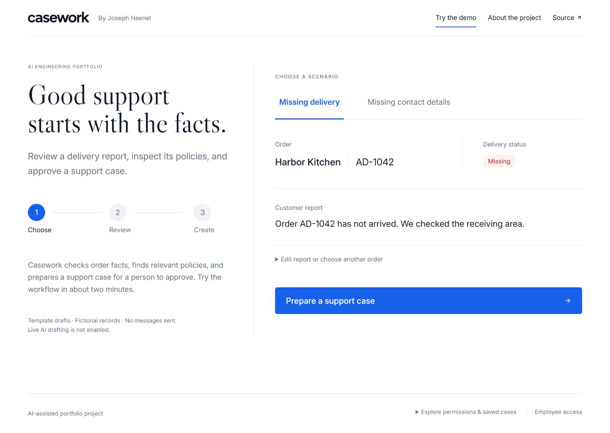
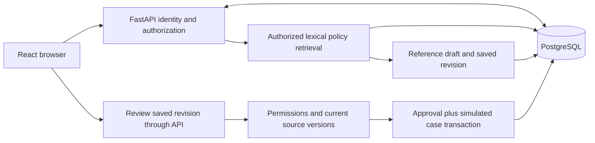

# Casework

Casework is a delivery-support portfolio application for Alder Distribution, a fictional distributor. An employee investigates a synthetic missing delivery, inspects authorized policies, edits a saved proposal, and approves that exact revision to create a simulated support case.

**First increment: reference mode.** Drafts use deterministic templates. PostgreSQL persistence, policy retrieval, permissions, approval, case creation, and recovery are implemented. No live model is called, no customer response is sent, and no external ticket is created. This is not the complete AI MVP or a production-readiness claim.

**[Live demo](https://opsdesk.josephhaenel.com)** · **[Source](https://github.com/josephhaenel/opsdesk)**

Hosting uses an isolated application and database on the project owner's existing VM. The verification report records the API, browser, and deployment checks and their limits.

## Try the workflow

1. Choose **Missing delivery**, the recommended scenario for AD-1042.
2. Select **Prepare a support case** to collect the record, supporting policies, and draft.
3. Review the suggested reply and proposed case. Open supporting evidence or edit the details when needed; save any edits before continuing.
4. Confirm that you reviewed the saved version, then select **Create demo case**.
5. Refresh to recover the same saved result and activity trail.

Choose **Missing contact details** for AD-1043 to see why approval is blocked until a callback is added and saved. Report editing, alternative orders, supporting records, activity, and technical details are available in expandable sections.

Under **Explore permissions & saved cases**, the manager identity can access AD-2041, escalation policies, and urgent priority. There are eight synthetic orders across three fictional customers and six versioned policies. Role identities are intentionally selectable; they demonstrate backend authorization rather than authenticating real employees. Mutable records are isolated per visitor and expire after 24 hours.

## What is implemented

- React/TypeScript interface with evidence, revision editing, review, results, and operational activity.
- FastAPI with server-issued opaque sessions, Origin and CSRF checks, strict request schemas, and backend account/role authorization.
- PostgreSQL full-text retrieval over permission- and applicability-filtered policies. No vector index or retrieval cache is used yet.
- Immutable proposal revisions bound to order/policy versions and a normalized payload digest.
- Approval, simulated case, operation result, and completion activity committed in one database transaction.
- Stable request IDs and a unique approved-action effect prevent duplicate cases and recover lost responses.
- Bounded database waits, public request limits, visitor growth caps, expiry cleanup, and a dedicated deployment network.
- Explicit schema bootstrap migration, pinned dependencies, frontend lockfile, Docker setup, and GitHub Actions checks.

The model will remain outside execution authority when live inference is added. Shape validation, authorization, required inputs, policy coverage, and approval checks are deterministic responsibilities.

## Architecture

One application and one database keep this workflow easy to inspect. The short same-database action is synchronous. A durable worker and provider adapter will be added together when live generation is introduced; Redis, microservices, autonomous tool loops, and MCP are unnecessary for this first fixed workflow.

## Setup and verification

See [local setup and hosting](docs/setup.md) for the complete application, separate development/test database, environment configuration, and VM layout. Secrets stay outside source control. Do not point tests at the deployed database.

The [verification report](docs/verification.md) records actual API/PostgreSQL runs, browser walkthroughs, and deployment checks. Eight initial [evaluation inputs](eval/reference-scenarios.jsonl) are included, explicitly marked as not model evaluated. No accuracy, cost savings, or business-impact numbers are claimed.

CI checks Python/frontend formatting, runs PostgreSQL/API checks, and builds the frontend without provider credentials. A passing source build does not substitute for the browser workflow or semantic evaluations.

## Guided engineering

Read the [architecture and decision records](docs/architecture.md), [API contract](docs/api-contract.md), [evaluation plan](docs/evaluation.md), and [glossary and learning checklist](docs/learning.md).

Each increment should explain the problem, concrete request flow, important code, alternatives, failures, and verification. The learning checklist tracks independent understanding rather than assuming it from generated code. This initial implementation and its documentation are AI-assisted; the owner should describe personal design, changes, debugging, and verification accurately.

The project draws on applied distribution/enterprise AI experience using entirely new synthetic examples. It contains no employer code, documents, customer data, or proprietary implementation. Company tenure must not be presented as time holding an AI Engineer title; estimated business cases must not become realized savings claims.

## Next increments

1. Add one structured model adapter and a durable generation worker with leases, bounded retries, fencing, and restart checks.
2. Measure lexical versus exact-vector/hybrid retrieval and validate grounded generation, abstention, and prompt-injection behavior.
3. Complete the asynchronous approval lifecycle, broaden fault injection, and expand toward the planned 72 evaluation scenarios.
4. Publish model/version, methodology, measured failures, and reproducible results; then produce a walkthrough video and expand the personal-website project entry into a case study.

The public repository and hosted reference workflow are useful early evidence. Applications can proceed while the remaining AI and learning increments are developed.

## Casework visual refresh

The public-facing product is now Casework: a light, two-column introduction and delivery-report workspace, with a typographic wordmark and restrained blue actions. The existing OpsDesk URL, repository, database and session keys stay stable. The review flow, exact-revision approval and durable case recovery remain unchanged.

[Design comparison and responsive checks](design-qa.md) document the selected direction and verification. Wordmark, favicon and font-license provenance are in [asset notes](docs/design/README.md).
