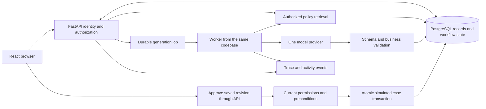

# OpsDesk architecture and decisions

This document describes the recommended complete MVP and its boundaries. It is a design, not evidence that the application is implemented. The first milestone implements only the deterministic approval and simulated-case path described in the project plan.

## System flow

The browser has no database or provider credentials. The worker and API share domain services and database contracts, not process memory. The model has no direct path to case creation.

## Concrete request walkthrough

1. A demo session identifies an employee with access to two customer accounts. The API resolves that identity from an opaque, expiring session cookie and current database grants. It does not trust a role or customer scope supplied in the request.
2. The employee submits the report for AD-1042 with a stable operation ID. The API validates input and authorizes the order before returning its delivery record. The order lookup is deterministic; it does not depend on a model guessing an identifier.
3. A retrieval query restricts policy candidates by current account/role permission, active version, and effective date. It then ranks those eligible candidates. Evidence carries policy/version/chunk IDs and readable text. Citation opening repeats authorization.
4. The generation worker assembles the authorized order facts and evidence. Retrieved content is untrusted source material; instructions inside a policy cannot grant permissions or activate tools.
5. The provider returns a structured draft: response, supported claims and evidence IDs, missing information, and suggested case fields. Refusal, incomplete output, invalid schema, unknown evidence IDs, and service failure become visible failure states. Structured output constrains shape; it does not prove factual correctness. [Official OpenAI documentation](https://developers.openai.com/api/docs/guides/structured-outputs).
6. Deterministic rules check required contact fields, order state, action category, priority authority, and policy applicability. Evidence existence and authorization can be checked in code; whether prose is truly supported also requires quality evaluation and human review. Known policy conflicts block a normal action; semantic conflicts can still be missed and belong in the evaluation suite.
7. The API saves an immutable proposal revision. The UI displays the draft, exact action fields, evidence, missing information, and status. A human edit creates another revision. It does not silently mutate an approved action.
8. Approval supplies the displayed revision ID. The server loads its own saved payload, checks the actor and current revision, and records what was approved. Execution checks relevant order/policy versions and current permissions again. A relevant change requires another review.
9. In one transaction, the simulator inserts the case, stores the result, and appends its completion event. The unique action key prevents duplicate cases. The browser reads the final case ID and event history after refresh or reconnect.

## Authorization boundaries

Employee: assigned accounts, ordinary policies, standard-priority cases. Manager: all fictional accounts, ordinary and escalation policies, urgent-priority cases. One API authorization service applies these rules to lookup, workflow/proposal access, evidence, approval, result retrieval, and trace viewing. Every data access path carries the actor's scope; checking only the visible screen is insufficient.

Use server-side opaque sessions with HttpOnly cookies. Require same-origin requests, explicit CSRF protection for mutations, expiration, and secure cookies outside localhost. The server role selector accepts only predefined demo identities. Production authentication would use an identity provider; this demo does not claim to authenticate real staff.

For the tiny corpus, filter the eligible rows and perform exact ranking without an approximate vector index. pgvector documents that approximate index filtering can return fewer qualifying results; evaluate recall before changing indexing strategy. [pgvector documentation](https://github.com/pgvector/pgvector#filtering).

Avoid a retrieval cache initially. Later caches would need permission and policy-version scope. Titles, citations, saved drafts, and traces can also leak restricted material. Recheck access to historical evidence and never send unauthorized text to the model. Reading a saved revision requires current access to its order and all source evidence. If a manager-created revision contains restricted material, deny the entire revision to an employee or generate a separate permitted revision; hiding its citation links is insufficient. Keep manager-only evidence out of customer-facing text unless the document's audience classification permits it.

Before public hosting, isolate mutable demo state per visitor and provide a reset mechanism. Both roles remain selectable within that synthetic sandbox. This is an isolation requirement for the demo, not multi-company product functionality.

## Action and approval contracts

The only side-effecting operation is `create_support_case`. Its validated inputs include authorized order ID, the fixed missing-delivery category, standard or urgent priority, contact information, reviewed summary, and permitted evidence references. The server derives the company and customer from the authorized order. Unexpected fields are rejected. Its output is a typed case ID and status.

A proposal revision stores normalized action arguments, reviewed response, evidence IDs and versions, order version, and business-rule version. Approval records actor ID, immutable revision ID, payload digest, approval time, and expiry. A digest detects changed content; it is not proof that a human reviewed it or a substitute for permission checks. Default approval lifetime for the planned asynchronous workflow is 15 minutes, an initial configurable product choice to test.

Editing supersedes the old revision. Within the case transaction, lock the workflow, order, and relevant policy activation records in a consistent order before comparing versions and validating fresh execution. This prevents an edit or source update between checking preconditions and creating the effect. A new execution rejects expired approval, stale preconditions, lost permission, and a different revision. The simulator never executes action arguments supplied afresh by the browser or model after approval.

## Transactions and recovery

Idempotency means repeated attempts at the same logical operation have the same persisted effect. It does not mean every request runs only once.

Use two keys: a scoped browser operation ID to recover the request, and a unique approved-revision key to recover case creation. Store a normalized request digest with the browser key; a reused key with different content is a conflict. A new browser key must still not execute the same approved revision twice.

“Check whether the case exists, then insert it” has a race if two requests both check before either inserts. Locking controls concurrent changes; a database unique constraint is the final duplicate guard. The approval, case, result, and completion event commit together. PostgreSQL documents these [uniqueness constraints](https://www.postgresql.org/docs/current/ddl-constraints.html#DDL-CONSTRAINTS-UNIQUE-CONSTRAINTS) and [row locks](https://www.postgresql.org/docs/current/explicit-locking.html#LOCKING-ROWS).

The first milestone runs this short same-database transaction synchronously. A timed-out browser retries the stable operation ID and reads the saved result. It cannot infer failure merely from the missing response. On retry, first authorize current access to the workflow/result and check that the operation ID matches the original payload. Return an already-committed result before applying fresh-execution expiry or stale-version checks. An expired approval does not undo a completed case. If there is no committed effect, validate the current revision and preconditions before executing. Do not hold a transaction open during a model call.

Later generation jobs persist state, attempt count, next attempt time, lease expiry, and last error. A worker claims a job briefly, releases the database transaction, and calls the provider. An expired lease permits recovery. A lease/version token prevents a late worker from overwriting a newer result. Generation may run more than once and incur additional cost; retry safety for a simulated case does not make provider calls free or exactly once.

Initial provider settings to examine: 30-second attempt timeout, at most three attempts including the first, exponential backoff with jitter, and a 60-second lease for a bounded attempt. Honor provider retry hints. Retry only selected transient failures; do not retry forbidden access, stale approval, invalid business inputs, or refusal as a service outage. These are configurable defaults, not measured optimal values.

If case execution is later queued, retain the same atomic case transaction and unique key. A crash before commit rolls back; a crash after commit recovers the stored result. This guarantee relies on the simulator sharing PostgreSQL. An external ticket API would require its own idempotency and reconciliation design.

## Workflow states and observability

Use explicit persisted states: `received`, `drafting`, `needs_information`, `needs_review`, `approved`, `executing`, `completed`, and `failed`. Job state is separate: `queued`, `running`, `retry_wait`, `succeeded`, or `failed`. Approval is a persisted record with expiry, not a checkbox or a model message. The synchronous first milestone commits its approval and completion together; the later asynchronous path can expose intermediate states. Do not leave a workflow marked completed unless its case result committed.

Start with structured logs, request/trace IDs, and a persisted activity trail. Add OpenTelemetry spans when retrieval and generation are introduced. Capture stage latency, queue wait, attempt count, evidence IDs/versions, provider/model IDs, token usage when available, error class, and action result. Cost is an estimate calculated from recorded usage and a dated pricing table; unavailable usage remains unknown. Fixture mode reports no model call rather than simulated token usage. Public traces show authorized operational steps, not hidden model reasoning, credentials, or unrestricted prompts.

## Architecture decisions

These records are proposed on October 3, 2026. Record adoption or changes with evidence as implementation proceeds.

| Decision | Recommended choice | Alternative and reason to revisit |
| --- | --- | --- |
| Application boundaries | Modular FastAPI app and React client | Microservices add deployment and consistency work; revisit only for demonstrated independent scaling or ownership needs. |
| Persistence | PostgreSQL with migrations | SQLite is easier initially but does not test the target database's locking behavior. Avoid maintaining two persistence paths. |
| Work scheduling | PostgreSQL jobs and one worker from the same codebase | Redis/Celery adds another service. Revisit for measured queue throughput or scheduling needs. In-process background tasks alone do not provide durable recovery. |
| Retrieval | Lexical baseline; evaluate filtered exact vectors and rank fusion | Vector-only ranking can miss exact identifiers. Approximate indexes and rerankers add tuning and cost; revisit after measured retrieval errors or scale. |
| Model integration | One narrow OpenAI adapter | Azure OpenAI fits existing experience but adds deployment/account setup. Avoid implementing both initially. Choose model snapshot using evaluations. |
| Action execution | Deterministic domain service with revision-bound review | Autonomous tool loops introduce authority and termination problems without helping this fixed workflow. MCP is unnecessary for an internal function. |
| Initial execution path | Short synchronous database simulator | Add asynchronous jobs when provider latency requires them; preserve atomic effects and recovery semantics. |
| Demo identity | Server-issued synthetic identity session | OIDC supplies real identity but expands initial scope. A browser-only role toggle supplies neither authentication nor backend authorization. |

## Data ownership

The first milestone needs demo identities/sessions, orders with delivery fields, workflows, immutable revisions, approvals, support cases, operation keys, and activity events. Retrieval adds versioned policies/chunks and evidence records. Asynchronous inference adds jobs and provider-run records. Each table exists to preserve a decision or recover an effect; do not create all of them before the increment needs them.
